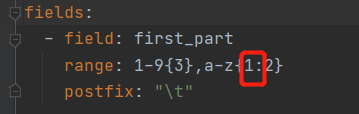
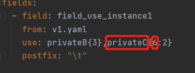
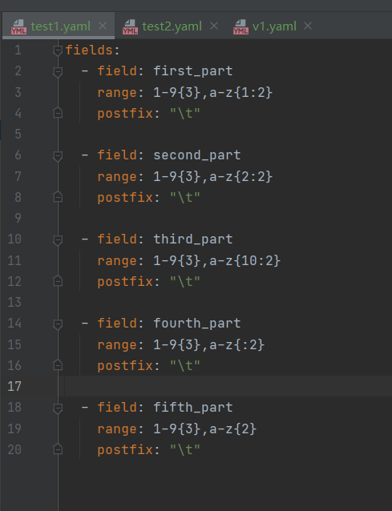
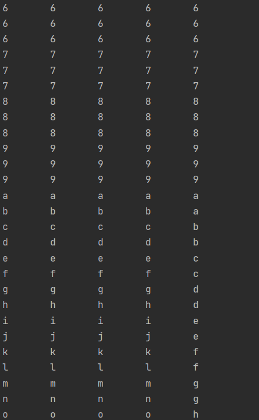
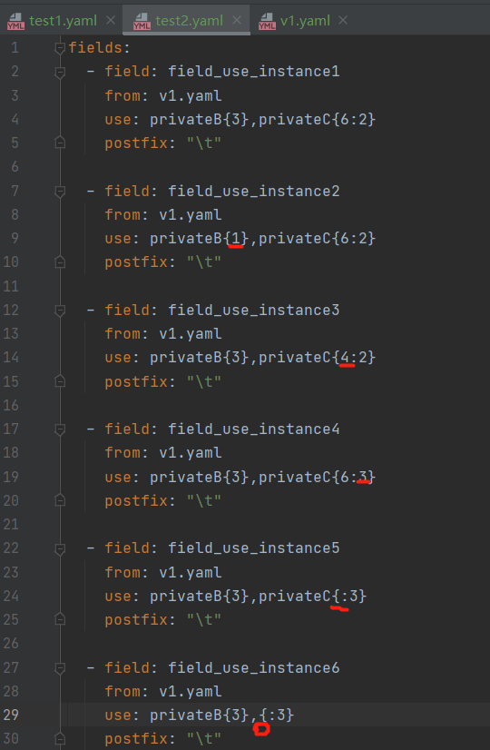
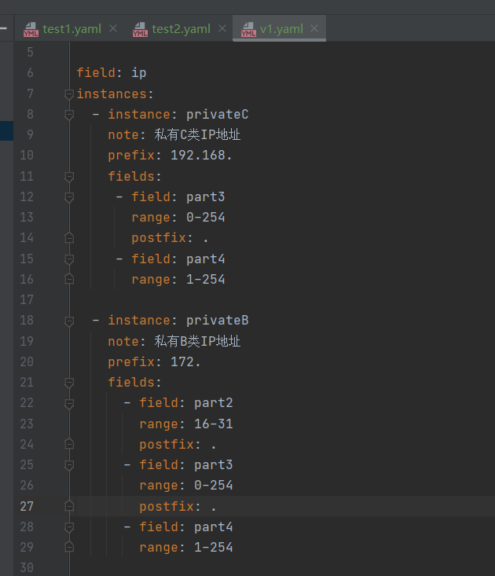

# 11/24困难

不明白红圈处的作用

## 1. 测试range

- **yaml文件test1.yaml**

- **生成数据：1-9{n}中n决定数字重复次数，a-z{m}中 m是纯数字的话决定字母重复m次，如果是其它的都不起作用**

## 2. 测试引用实例

- 文件test2.yaml

  

- 实例文件v1.yaml

  

- 生成的数据：**privateB{n}**中**n**不影响结果，**privateC{m1:m2**}中:**m2**决定了重复次数，**m1**也不影响结果，甚至privateC写错不写也不影响结果

  

**以上实验文件都在同目录下**。

